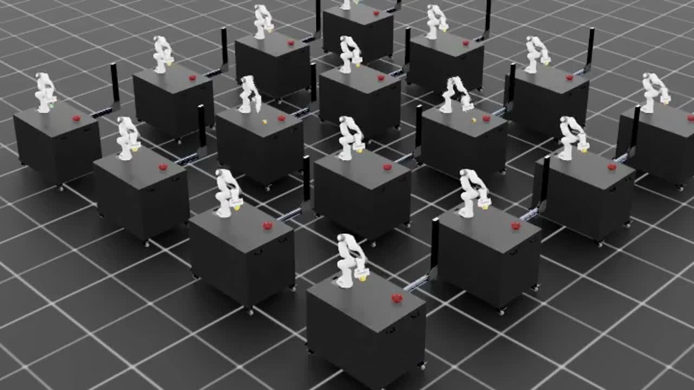
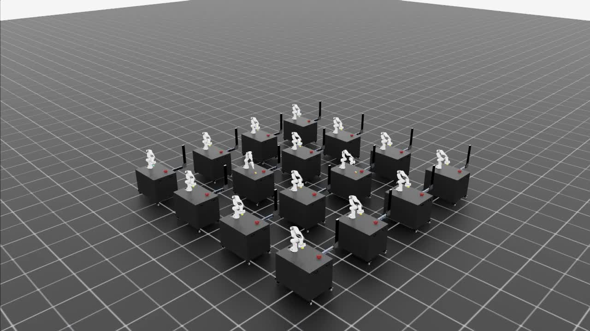

<h1 align="center">🤖 Object in Bowl</h1>

<p align="center">
  Teaching a robot arm to pick up a cube and drop it in a bowl — trained with reinforcement learning in <b>NVIDIA Isaac Lab</b>.
</p>

<p align="center">
  <video src="training_reports/2026-06-28-gated-lift-progress-cont-1000/media/gated_lift_progress_cont_1000_center_crop.mp4" width="720" controls></video>
</p>

<p align="center">
  
  
</p>

---

**What's in here**

- `custom_tasks/object_in_bowl` — the Isaac Lab task package (reach → lift → transport → place)
- `scripts` — training, eval, and smoke-test helpers
- `tools` — shared debugging utilities, including a browser debug viewer
- `training_reports` — experiment write-ups with videos from each training run

**Quickstart**

```bash
# with Isaac Lab installed in your python env:
python -m pip install -e custom_tasks/object_in_bowl

# train (pick your RL library's script)
python scripts/rsl_rl/train.py --task=Isaac-Object-In-Bowl-Franka-v0

# watch it play
python scripts/rsl_rl/play.py --task=Isaac-Object-In-Bowl-Franka-v0
```

16 environments train in parallel on one GPU. Full experiment history lives in [`training_reports/`](training_reports/).
